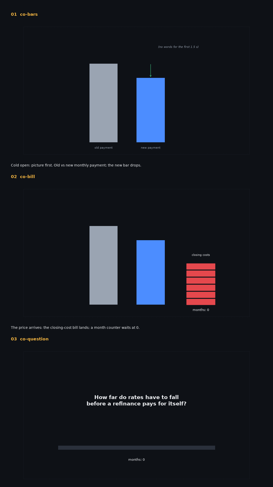
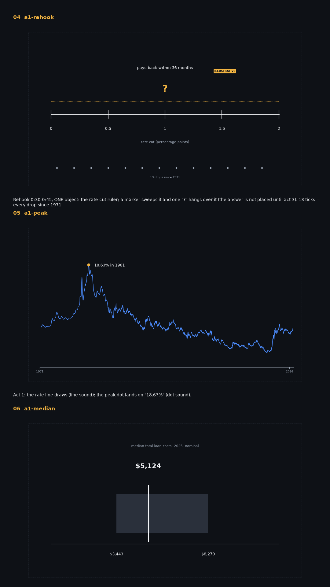
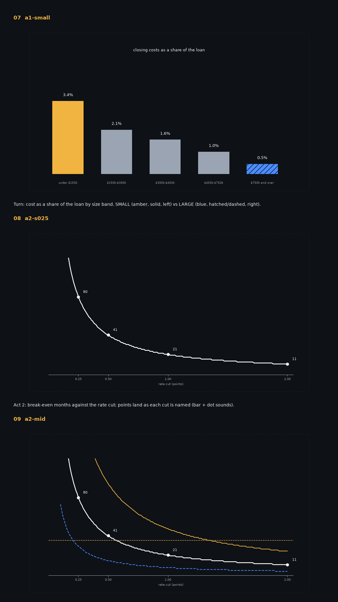
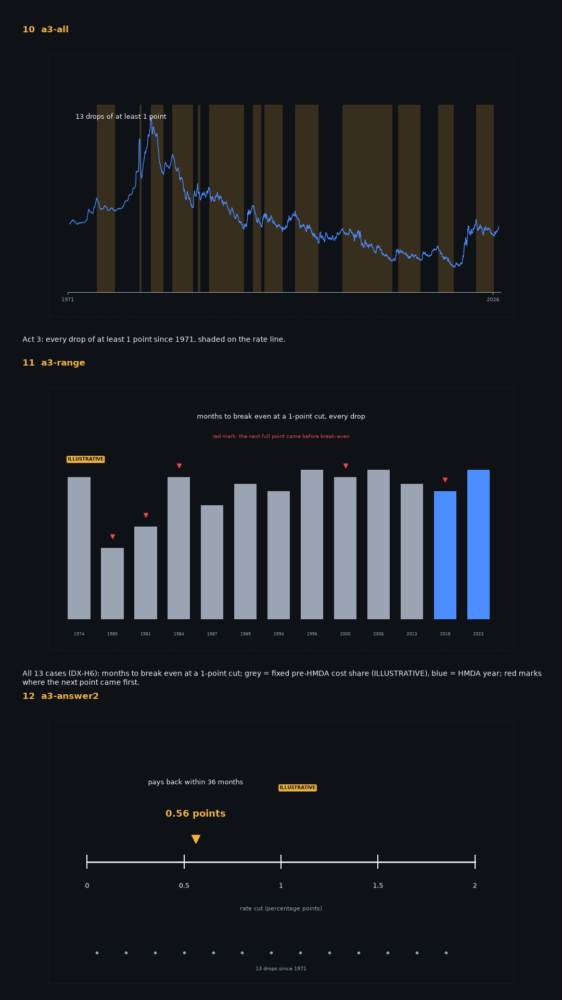

# Episode 1 — storyboard M1b (key frames)

Drawn from the data by `preprod/storyboard.py`; not the final render. Dotted rectangle = 90% safe area. Every shot: `shotlist.md`.

- **01 `co-maya`** Cold open (G-007): one person, one moment. Maya, October 2023: her loan and her rate.
- **02 `co-today`** Her rate against this week's average on the same line.
- **03 `co-cost`** The lender's offer: the closing-cost bill lands; the question and an empty month counter.

- **04 `a1-rehook`** Rehook 0:30-0:45, ONE object: the rate-cut ruler with Maya at its end; the marker sweeps, one "?" (no answer yet).
- **05 `a1-turn`** Act 1 turn: the bill hits Dan, Maya and Priya differently (cards, their medians, ILLUSTRATIVE).
- **06 `a2-real`** Act 2 thesis: balance still owed on both loans (left); savings alone vs savings + balance gap against the bill (right): 24 becomes 30.

- **07 `a2-cliff`** The two answers across every cut: the simple division (dashed) and counting what is owed (solid, "never" below 0.25).
- **08 `a3-range`** Act 3: every drop since 1971 (DX-H6), both answers per drop.
- **09 `a3-answer2`** Answer: the rehook ruler returns; Maya 0.5, Dan 1.12, Priya 0.2; today's cut 0.59 marked.

- **10 `m-assume`** Method card (static, readable).

