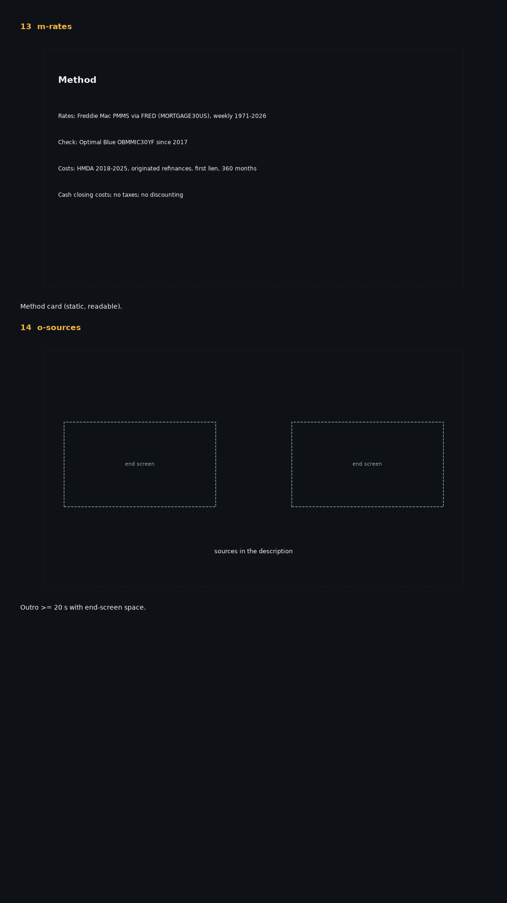

# Episode 1 — storyboard (key frames)

Drawn from the data by `preprod/storyboard.py`: composition, numbers and what moves; not the final render. Dotted rectangle = 90% safe area. Full shot-by-shot list: `shotlist.json` / `shotlist.md`.

- **01 `co-bars`** Cold open: picture first. Old vs new monthly payment; the new bar drops.
- **02 `co-bill`** The price arrives: the closing-cost bill lands; a month counter waits at 0.
- **03 `co-question`** Open question (answered in act 3 on the same ruler).

- **04 `a1-rehook`** Rehook 0:30-0:45, ONE object: the rate-cut ruler; a marker sweeps it and one "?" hangs over it (the answer is not placed until act 3). 13 ticks = every drop since 1971.
- **05 `a1-peak`** Act 1: the rate line draws (line sound); the peak dot lands on "18.63%" (dot sound).
- **06 `a1-median`** The bill: median total loan costs and the middle half (HMDA 2025, rate-and-term refinances).

- **07 `a1-small`** Turn: cost as a share of the loan by size band. SMALL (amber, solid, left) vs LARGE (blue, hatched/dashed, right).
- **08 `a2-s025`** Act 2: break-even months against the rate cut; points land as each cut is named (bar + dot sounds).
- **09 `a2-mid`** Turn 2: the 36-month line (ILLUSTRATIVE) crosses the MEDIAN, SMALL and LARGE curves at different cuts.

- **10 `a3-all`** Act 3: every drop of at least 1 point since 1971, shaded on the rate line.
- **11 `a3-range`** All 13 cases (DX-H6): months to break even at a 1-point cut; grey = fixed pre-HMDA cost share (ILLUSTRATIVE), blue = HMDA year; red marks where the next point came first.
- **12 `a3-answer2`** Answer: the rehook ruler returns; the marker lands on the answer.

- **13 `m-rates`** Method card (static, readable).
- **14 `o-sources`** Outro >= 20 s with end-screen space.

