# Tập 2 — Storyboard (C5, stream D; from the C4 animatic)

Frames: `animatic/strips/Sxx.png` (6 frames per scene, evenly spaced in the scene's sentences) and `animatic/strips/KEY-n.png` (+ `-masked`). Picture notes: `story/script.md` v5 (picture column), adapted in C4 as listed in `animatic/README.md` ("Cần chủ dự án xem").

## S01 — Two offers (cold-open, offer/two-cards, H2)

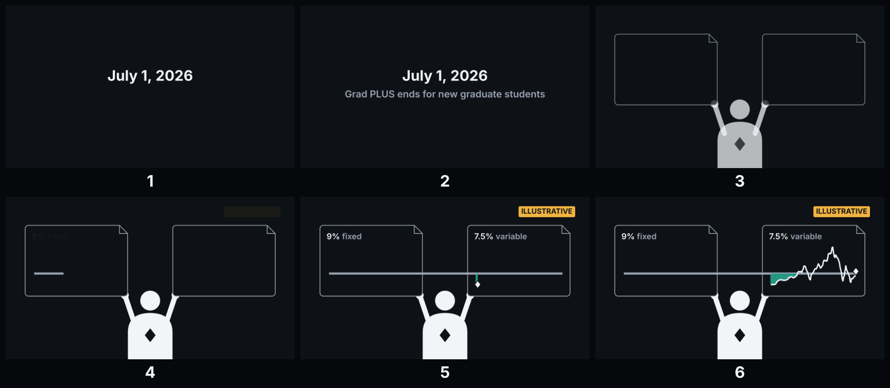

- S01.1: Calendar leaf turns to July 1, 2026; a federal form slides into a drawer that shuts.
- S01.2: Night desk, laptop. A level rail (fixed) and, just below it, a bead on a short wavy track (variable). ILLUSTRATIVE badge.
- S01.3: The track ahead of the bead wavers; the gap between bead and rail glows. Title card. (KEY-1)

## S02 — Why private loans (act1, cost/federal-limit, H2)

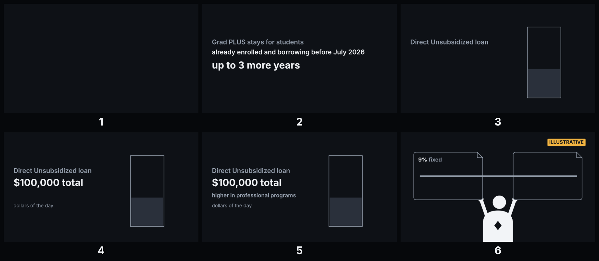

- S02.1: A second student keeps a PLUS form; an hourglass beside it.
- S02.2: One federal form; one big figure at a time.
- S02.3: A cost bar taller than the federal block; the remaining slice becomes a private-lender block that splits into the two offers.
- S02.4: The two offers side by side.

## S03 — Leah's loan and the head start (act1, offer/head-start, H2)

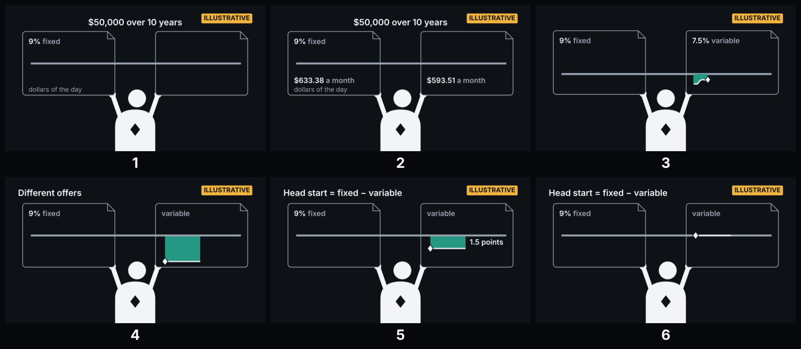

- S03.1: $50,000 stack under each offer; ILLUSTRATIVE badge pulses once.
- S03.2: Two envelopes; the variable one visibly thinner.
- S03.3: The level rail; a row of identical envelopes.
- S03.4: The bead rides its track up and down; envelopes thicken and thin; the track ahead fades out.
- S03.5: A coloured bracket snaps between rail and bead at the start line. (KEY-2)
- S03.6: Bracket labelled "1.5 points".
- S03.8: Bracket widens, narrows, closes, then flips with the bead starting above the rail.

## S04 — Every stretch since January 1954 (act1, ridge/replay, H3)

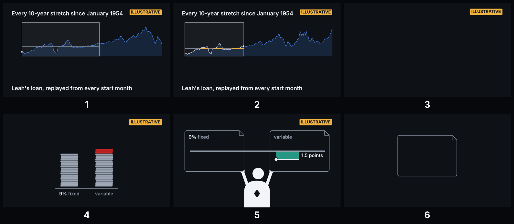

- S04.1: The short track stretches left into a long ridge of rate history.
- S04.2: The bead's track takes the ridge's month-to-month steps inside a 10-year frame.
- S04.3: Two coin piles (interest paid), fixed and variable, side by side.
- S04.4: The bracket slides along a ruler.
- S04.5: A ruler across the screen; a blank offer card floats toward it.
- S04.6: The ridge ends at today; empty space to its right.

## S05 — The contradiction (act1, ridge/bins, H3)

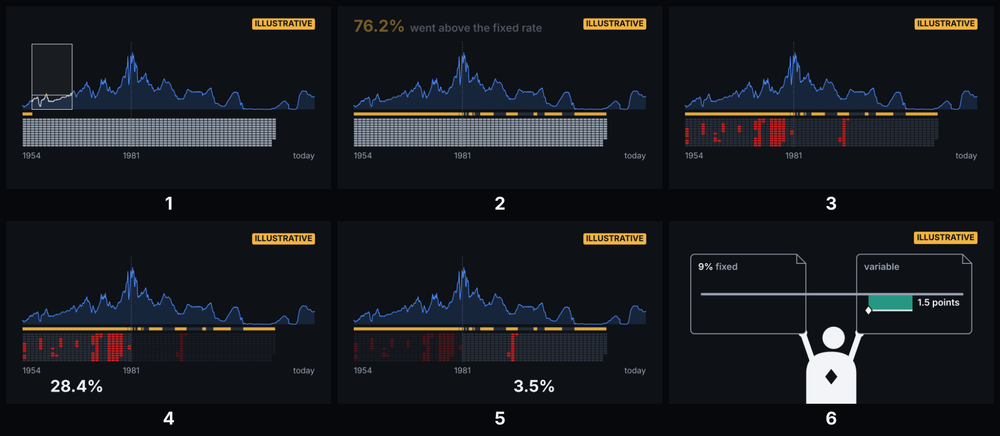

- S05.2: Stretch after stretch: the rail lights amber wherever the bead is above it; amber nearly everywhere.
- S05.3: Tokens drop into the two bins under the ridge; only some turn red.
- S05.4: Left bin (under the climbing half) clearly redder than the right; one dark token in the left bin. (KEY-3)
- S05.5: Bracket returns.

## S06 — The cushion (act2, jar/cushion, H2)

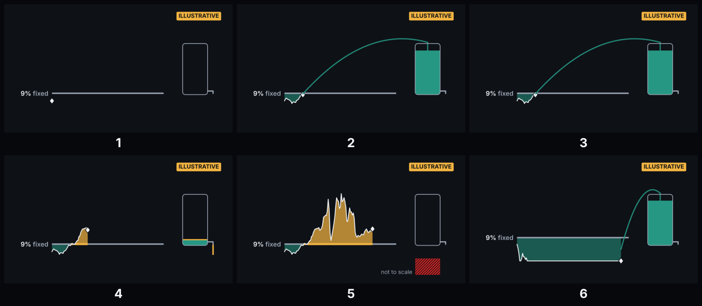

- S06.1: A green jar fills while the bead is under the rail. (KEY-4)
- S06.2: The debt stack is tallest at the left; the jar fills fastest there.
- S06.3: Rail lights amber; the jar drains.
- S06.4: Two runs: a brief amber blip barely lowers the jar; a long early climb drains it dry.
- S06.5: Bead sinks under the rail; jar keeps filling.

## S07 — Two kinds of history (act2, ridge/two-halves, H3)

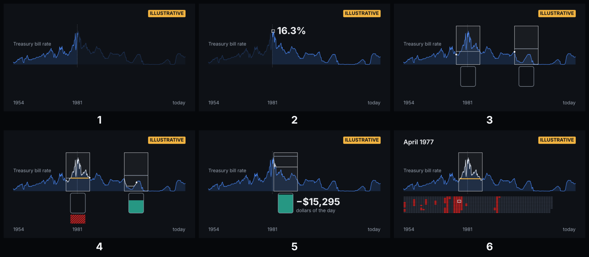

- S07.1: Camera pulls back to the whole ridge with its two bins.
- S07.2: Left half of the ridge rises in waves above the left bin.
- S07.3: Summit marked; the right half slopes down above the right bin.
- S07.4: Two identical beads set on the two halves of the ridge.
- S07.5: Left: bead climbs, jar drains. Right: bead sinks, jar fills.
- S07.6: One right-bin token glows bright; its jar brims.
- S07.7: Camera swings from the bright token in the right bin to the dark token in the left bin. On screen (recall, no new figures): Leah's two shares.

## S08 — The worst stretch: April 1977 (act2, ridge/worst-window, H3)

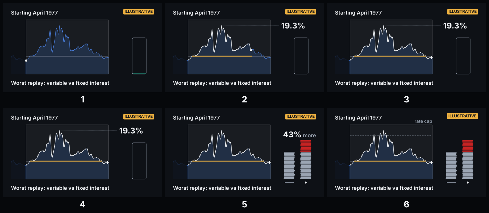

- S08.1: The 10-year frame lands on a steep climbing section of the ridge; Leah's desk appears inside it. (KEY-6)
- S08.2: Jar fills a little.
- S08.3: Bead far above the rail; the rail glows amber for years.
- S08.4: Jar empty; coins keep adding to her pile.
- S08.5: Her envelope swells well past the fixed one.
- S08.6: Fixed coin pile.
- S08.7: Variable pile = fixed pile + an extra block reaching a bit under half its height; on screen: "+$11,219" (`worst_diff`).
- S08.8: A ceiling line drawn over the bead, then lowered; the extra block trims.

## S09 — Moving the head start (act3, columns/head-start, H3)

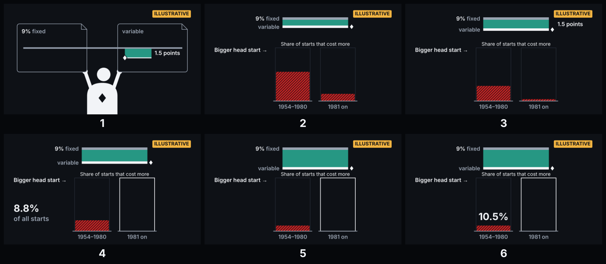

- S09.1: Leah's bracket.
- S09.2: A slider under the bracket; the rail pinned. (KEY-7 begins)
- S09.3: Offer cards line up along the slider.
- S09.4: Leah's card clicks onto the slider; her bins as before (no new figures).
- S09.5: Right bin goes fully grey; left bin keeps a red layer. On screen only: "8.8%" (`spread2_share`).
- S09.6: Slider at the far end; left bin still holds a thin red layer; small extra block remains. On screen only: "4.5%" (`spread3_share`).

## S10 — Other offers, and the answer (act3, columns/answer, H3)

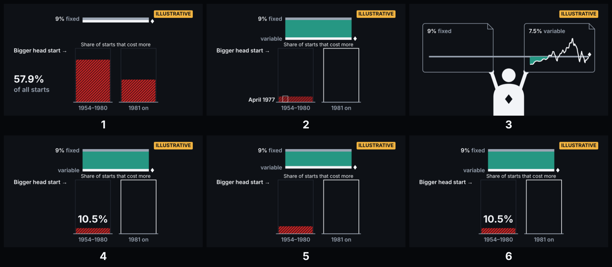

- S10.1: Slider sweeps back through 1 point and 0 to −1; both bins fill red, extra block grows. On screen only, one figure per moment: 1 point "31.3%" (`spread1_share`), "54.9% / 13.5% / +$12,983" (`gap10_early`, `gap10_late`, `gap10_worst`); 0 points "57.9%" (`spread0_share`), "79% / 42% / +$16,566" (`gap00_early`, `gap00_late`, `gap00_worst`); −1 point "72.9%" (`spreadm1_share`), "92.9% / 57.8% / +$20,217" (`gapm10_early`, `gapm10_late`, `gapm10_worst`).
- S10.2: The dark token never leaves its spot in the left bin.
- S10.3: Left bin's red layer never clears.
- S10.4: The question from S01 over the ruler.
- S10.5: Two bins under the two halves of the ridge.
- S10.6: Right bin clear at the 2-point mark; left bin with a thin red layer at the 3-point mark.
- S10.7: The ridge ends at today; the space to its right stays empty.

## S11 — How we know this (method, card/method, H3)

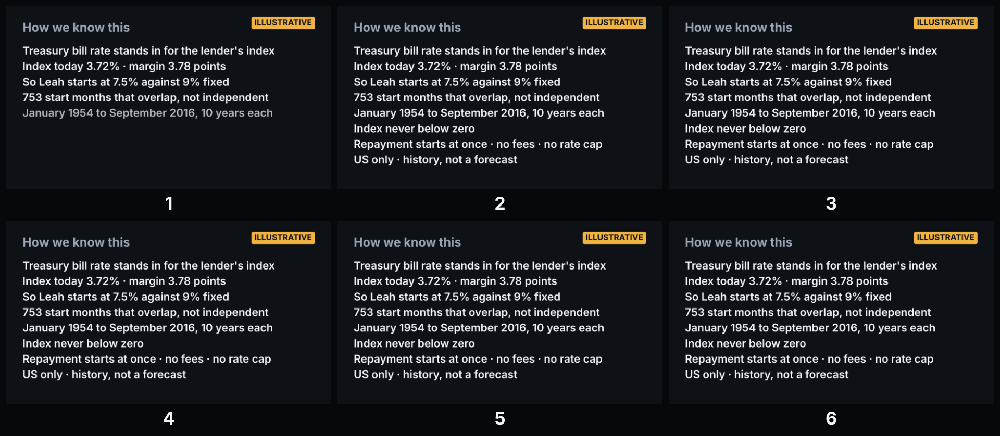

- S11.1: METHOD CARD (C2b, chủ dự án): toàn bộ phần phương pháp cũ S11.2–S11.6 lên thẻ + mô tả — lender index + fixed margin; T-bill stand-in, margin set so Leah starts at 7.5% (`var_start`); first replay January 1954, then monthly to September 2016 (`first_start`, `last_start`), each 10 years (`term`) against 9% fixed (`fixed_rate`); neighbouring stretches overlap, not independent; US only. Giữ nguyên nội dung thẻ cũ: Workbench view of the ridge. METHOD CARD (on screen, and in the description): "3-month T-bill stands in for the lender's index · 3.72% in August 2026" (`index_today`) · "margin 3.78 points" (`margin`) · "753 start months" (`n_starts`) · "index never below 0" · "no grace period · no fees · no rate cap". · **Đọc được ở 25% (G-014, sàn 40 px @1080) và hiện đủ lâu để đọc: ≥ 1 s mỗi 3 từ của thẻ, kéo sang đầu S12 nếu cần (P đo ở C4).**

## S12 — Where an offer falls (outro, columns/offer-line, H3)

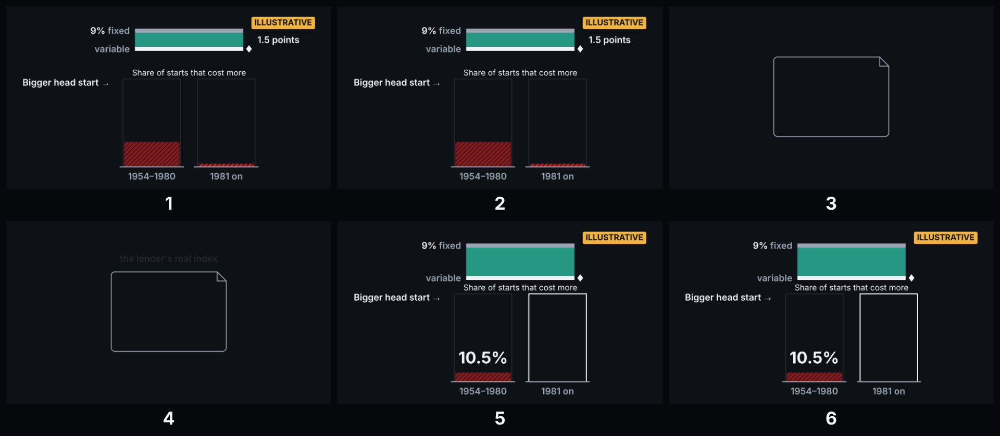

- S12.1: Leah's card on the ruler, ILLUSTRATIVE badge, just left of the 2-point tick.
- S12.2: Blank offer card hovers above the ruler, not placed.
- S12.3: Five plain objects around the card (index ribbon, ceiling, hourglass, receipt, wallet).
- S12.4: Ruler with both bins at every mark.
- S12.5: Ridge fades; empty space to the right of today.

## S13 — End screen (outro, card/end-screen, H3)

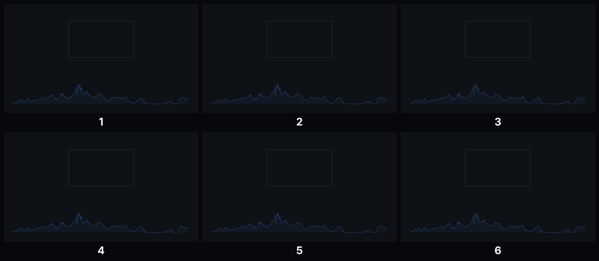

- S13.1: End-screen layout; ridge as a quiet background.
- S13.2: Video element slot; remaining ~12 s music only.

## Key beats

- KEY-1: 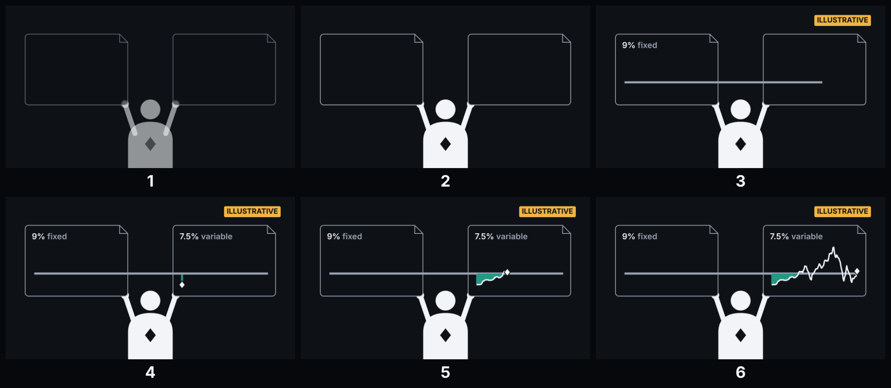 · masked: `animatic/strips/KEY-1-masked.png`
- KEY-2: 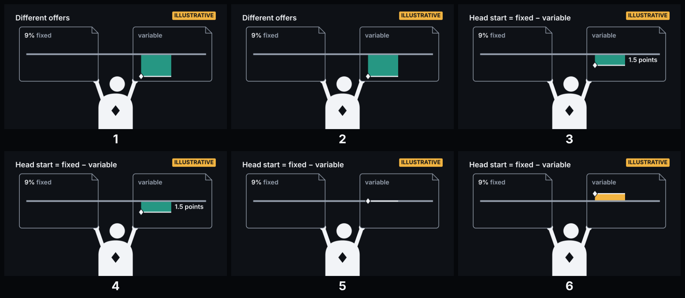 · masked: `animatic/strips/KEY-2-masked.png`
- KEY-3: 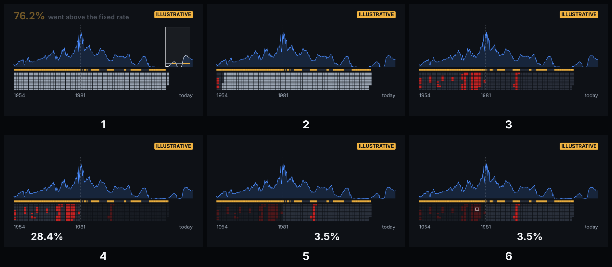 · masked: `animatic/strips/KEY-3-masked.png`
- KEY-4: 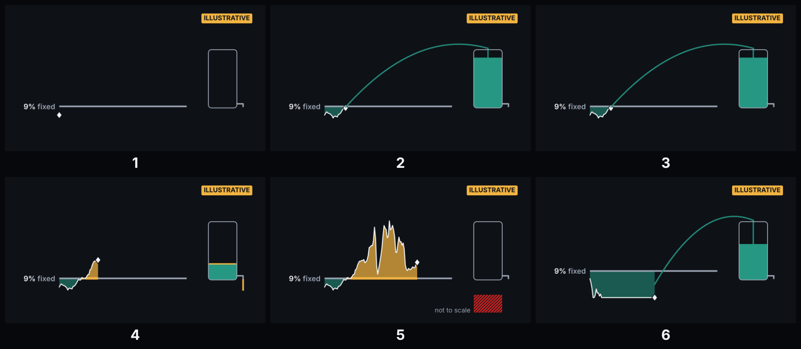 · masked: `animatic/strips/KEY-4-masked.png`
- KEY-5: 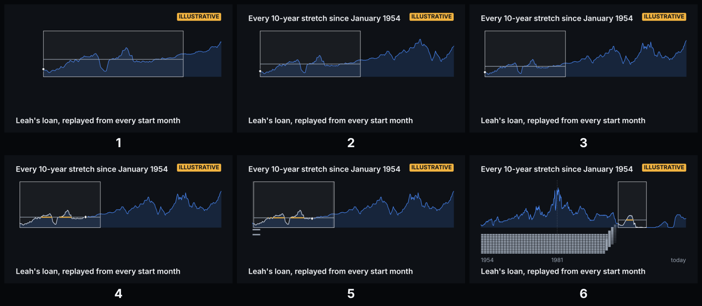 · masked: `animatic/strips/KEY-5-masked.png`
- KEY-6: 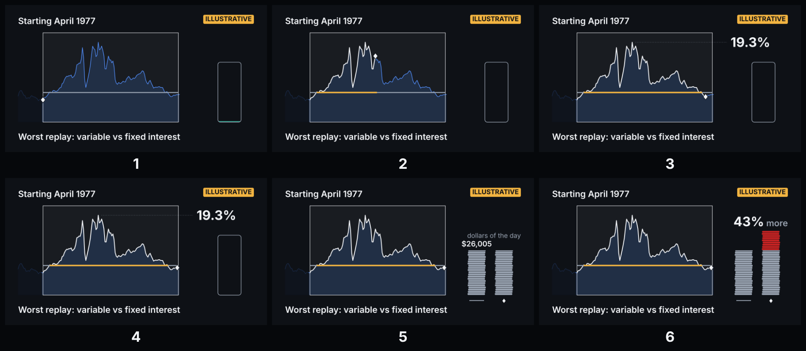 · masked: `animatic/strips/KEY-6-masked.png`
- KEY-7: 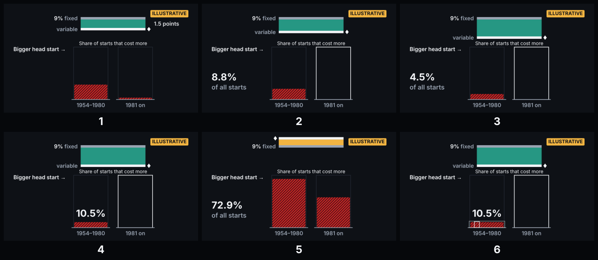 · masked: `animatic/strips/KEY-7-masked.png`
